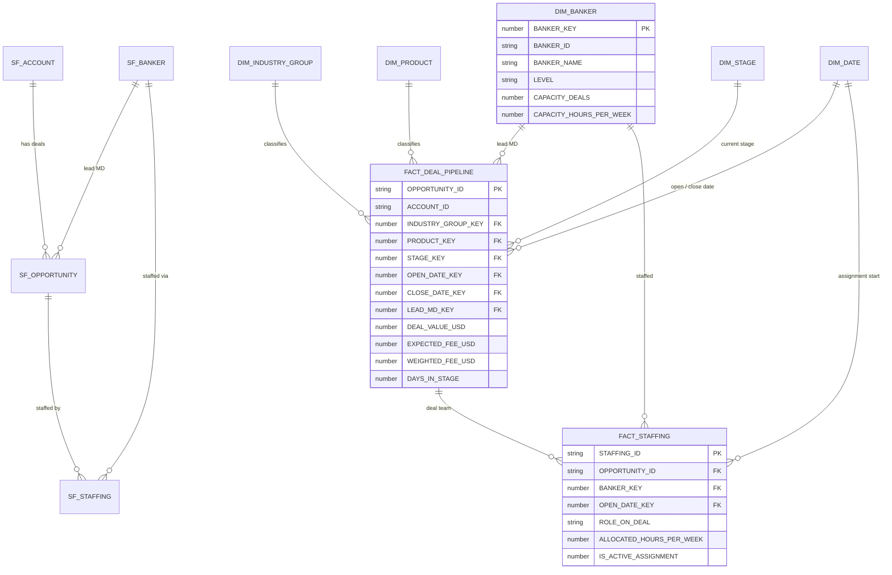

# Architecture — IB Deal Pipeline & Banker Staffing Semantic Model

> **SYNTHETIC DATA.** Every record in this project is generated synthetically
> (`src/generate_data.py`, fixed seed) to mirror the shape of a real
> Salesforce → Snowflake → Power BI investment-banking pipeline. No real
> client, deal, or banker data is used anywhere.

## Flow

1. **Salesforce-style extracts** (`data/*.csv`) — Account, Opportunity,
   banker roster (User-style), and staffing assignments, generated to land
   exactly like scheduled Salesforce extracts would.
2. **Snowflake staging** (`sql/01_staging_sfdc.sql`) — 1:1 landing tables
   plus cleansing views mirroring the Salesforce objects.
3. **Snowflake star schema** (`sql/02_star_schema_ddl.sql`,
   `sql/03_load_facts.sql`) — two facts (`FACT_DEAL_PIPELINE`,
   `FACT_STAFFING`) sharing conformed dimensions, designed for direct
   import into a Power BI semantic model.
4. **Power BI / DAX** (`dax/`) — a 35-measure catalog (pipeline value,
   weighted fee forecast, win rate, days in stage, banker utilization)
   with dynamic row-level security via a `UserAccess` table and
   `USERPRINCIPALNAME()`.
5. **Staffing analytics** (`src/staffing_utilization.py`) — active deal
   load and allocated hours vs capacity targets by banker level
   (Analyst → Managing Director), flagging over/under-staffed bankers.

## Entity-relationship diagram

## Design notes

- **Conformed `DimBanker`** serves both as the lead-MD role on
  `FactDealPipeline` and the staffed banker on `FactStaffing`, so
  utilization and pipeline measures share one security filter path.
- **Stage probability** lives on `DimStage`, keeping the weighted fee
  forecast (`ExpectedFeeUSD x CloseProbability`) consistent between DAX
  and SQL.
- **Dynamic RLS** (see `dax/DAX_CATALOG.md`) filters dimensions through a
  `UserAccess` mapping rather than hard-coded roles, because coverage
  bankers cross industry groups when staffed on a deal.
